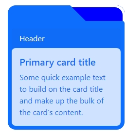
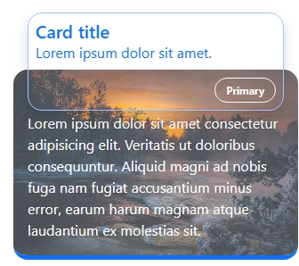
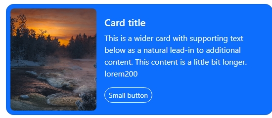

# Card Design Collection

A collection of card designs created with Bootstrap, showcasing various styles for displaying content. This repository currently contains **4 unique card designs**, with more planned for the future.

## Table of Contents

- [Demo](#demo)
- [Card Designs](#card-designs)
- [Getting Started](#getting-started)
- [Features](#features)
- [Technologies Used](#technologies-used)
- [Future Plans](#future-plans)
- [Contributing](#contributing)
- [License](#license)

## Demo

To see the card designs in action, open `index.html` in your browser. *(Link to a live demo if available)*

## Card Designs

### Card Design 1: A folder design card


### Card Design 2: Elevated card


### Card Design 3: Vertical Normal Card


### Card Design 4: Responsive horizontal card


## Getting Started

1. **Clone the repository**:
   ```bash
   git clone https://github.com/abhijitdey3322/card-design.git
   cd card-design
